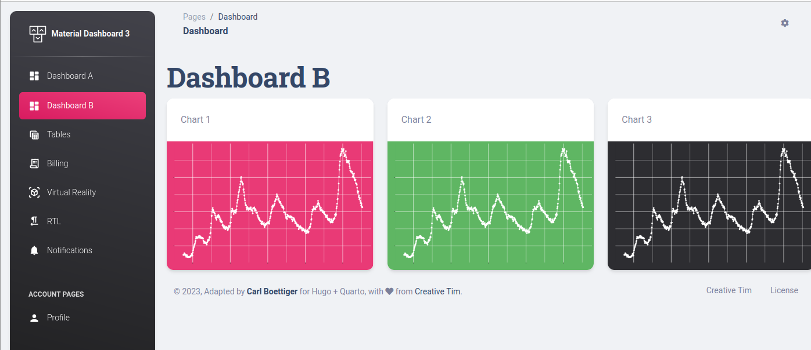

# quarto-hugo-material-dashboard

Adapting material-dashboard to Quarto and Hugo

[Demo site](https://quarto-hugo-material-dashboard.netlify.app/posts/dashboard-b/)


While quarto's built-in website support is quite flexible and feature-rich, we are still constrained in the overall look and feel of a website.
Using quarto's [hugo format](https://quarto.org/docs/output-formats/hugo.html), however, allows us to achieve more complete control over layout and appearance.
It is important to note that this comes at some cost of foregoing pre-packaged features and layouts in [quarto websites](https://quarto.org/docs/websites/).
Instead, we rely on the (much richer and widely developed) tooling directly from hugo.
This approach is comparable to `blogdown`, with quarto essentially relegated to the role of executing `.qmd` code into `.md` consumed by hugo.
Of course being `quarto`, this approach could work equally well with exclusively Python-based code examples without even installing R, or use a mix of the languages and engines.

This repository contains a stand-alone hugo theme in `themes/material-kit5`, built 
around assets provided by [Material Dashboard 2 from Creative Tim](https://www.creative-tim.com/learning-lab/bootstrap/quick-start/material-dashboard) 
under the open-source MIT License.





## Local Build

```bash
quarto render
hugo -c _site/content -b {baseurl}
```

## Automated deploy

- Ensure you have a gh-pages branch (e.g. check 'copy all branches' if using template repo.)
- GitHub Actions should be already configured.  This will use `quarto-dev/quarto-actions/publish@v2` (see [quarto-dev/quarto-actions](https://github.com/quarto-dev/quarto-actions)) to render the quarto files to `gh-pages` branch.
- From there, activate a Netlify deploy to hugo against the gh-pages branch to deploy the site.